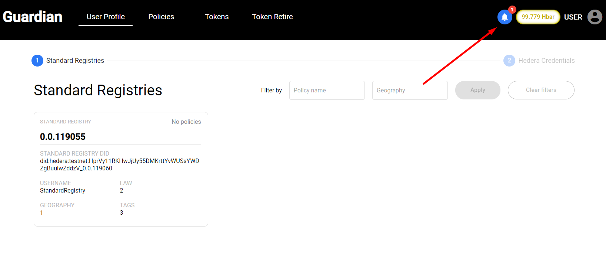
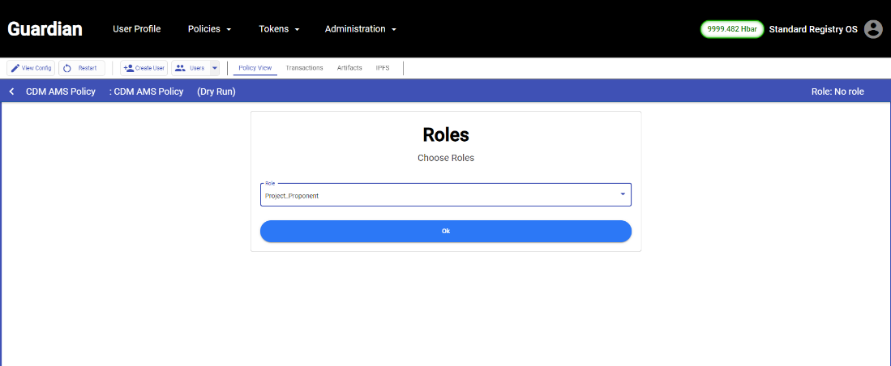
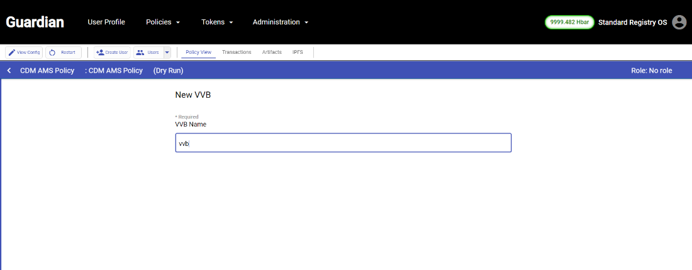
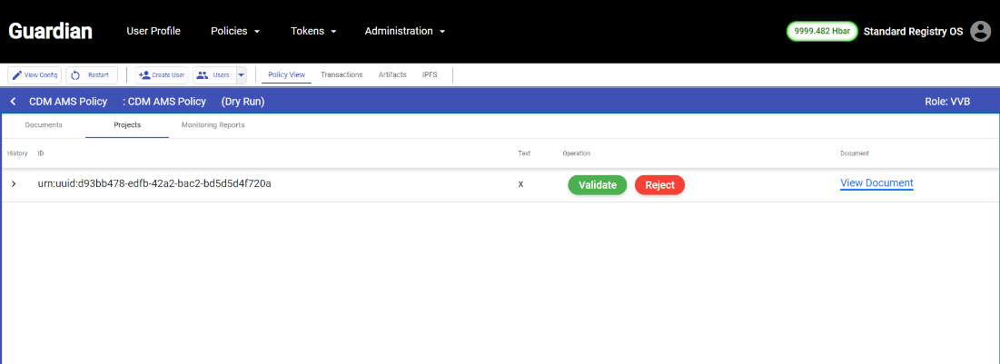

# 🔎 MRV Document Operations

For a demo example of following steps, here is the policy timestamp: **1675164736.675731674**

## **Task Summary**

There are two roles: ‘**User**_**’**_ and _**‘**_**Approver**_**’**_. _User_ can create projects and send project definition documents to the selected _Approvers_. After the approval, _User_ can add MRV reports to the project. On the basis of this documents the policy will be minting tokens into the account configured in the project.

## **Preparation**

1. Create 2 roles ‘**User**_**’**_ and ‘**Approver**_**’**_ and the corresponding containers

(See [example 1](creating-and-using-roles.md) for the more detailed description of how to work with roles)

2. Create all needed document schemas:

2.1 Schema for ‘**User**_**’**_ containing the fields: **First name**, **Last name**

2.2 Schema for ‘**Approver**_**’**_ containing the fields: **First name**, **Last name**

2.3 Schema for ’**Project**’ containing the fields: **Project name**, **Account ID**

In order to mint tokens into another account (not into the account of the minting user) setup the required field

.png>)

2.4 Schema for ’**Report**’ containing the following fields: **Start Date, End Date, Amount**

(Please see [example 2](data-input-via-forms-using-roles-to-partition-user-activities..md) _for the more detailed description of how to work with Documents_)

3. Add blocks for registering ‘**User**_**’**_ and ‘**Approver**_**’**_ into the containers created in the step 1

**Note:** it is important that DID of the user is used for ID of the documents as this value will be used further in the document for filtration

.png>)

4. Add simplified grids for displaying Projects, Reports and Tokens

5. Create the token

.png>)

## **Document Operations**

### 1. Project Definition

#### 1.1 Create a project

.png>)

### 1.2 Save the project

.png>)

### 1.3 Link to the token

1.3.1 Since another (not current user) account is used for minted tokens ’**tokenActionBlock**’ cannot be used, instead we will use ‘**tokenConfirmationBlock**_**’**_

1.3.2 To configure the target account for mixed tokens select ‘_Custom_’ value for ‘_Type_’ and the filed in the document from which to take the value for the Account ID (this field must have type: ‘**Account**’)

.png>)

1.3.3 By default ’**tokenConfirmationBlock**’ does not have a link to the next block, thus it needs to be manually added

1.4 Add an approver as after the creation the project is not assigned to anyone

1.4.1 Add ’**interfaceActionBlock**’ wrapped into a container.

.png>)

1.4.2 Select **Dropdown **_**** value **** for ****_** Type**

.png>)

1.4.3 Use system field **assignedTo** to filter documents based on users they are assigned to.

Record value from **assignedTo **_**** into_ **Field** (This field will be changing our block)

.png>)

1.4.4 Configure values from which fields from the document would be labels, and which ones would be values

.png>)

1.4.5 Use ‘**documentsSourceAddon**’ for data for **Dropdown**_**.**_

.png>)

1.4.6 Save the changed document

 (1).png>)

1.4.7 As ‘**documentsSourceAddon**’ does not have default events, we need manually add them.

1.4.8 Return to grid settings and add **Dropdown** into the target column.

.png>)

1.5 Project Approval. Setting up the grid for project approvals.

1.5.1 To select only the projects assigned to the current Approver set the ‘**Assigned to User**’ flag

 (1).png>)

1.5.2 Add document approval block

_(Please see_ [_example 2_](data-input-via-forms-using-roles-to-partition-user-activities..md) _for the more detailed description of this workflow)_

1.5.3 Add Approve button into the grid

 (1).png>)

1.5.4 After the Approve, setup the KYC for the account connected to the project

Use ‘**tokenActionBlock**’ with the appropriate settings

<figure><figcaption></figcaption></figure>

1.5.5 Configure the signing/verification of the document with the Approver signature by adding ‘**reassigningBlock**’. This block creates a copy of the source document and re-signs it with the key of the selected user.

<figure><figcaption></figcaption></figure>

1.5.6 Add Status attribute for easy filtering

<figure><figcaption></figcaption></figure>

### 2. Report.&#x20;

To enable report creation only for approved projects, add create button into the grid selectively for documents with ‘Approved’ status

2.1 Add a ‘**documentsSourceAddon**' block to differentiate the documents on the basis of their status

<figure><figcaption></figcaption></figure>

2.2 Repeat the sequence for project creation to create the report


**Note:** switch off ‘**Default Active**’ since create report button does not need to be an independent object


<figure><figcaption></figcaption></figure>

2.3 Add the button for creating reports into the grid

<figure><figcaption></figcaption></figure>

2.4 Use ‘**mintDocumentBlock**’ for creating (minting) tokens

<figure><figcaption></figcaption></figure>

### 3. Results

#### 3.1 Reports

3.1.1 Add grid to display reports

<figure><figcaption></figcaption></figure>

3.1.2 To filter reports on the basis of their project add dynamic filter ‘**filtersAddon**’

<figure><figcaption>
Adding FiltersAddon
</figcaption></figure>

3.1.3 Documents created on the basis of other documents are automatically linked via the _**ref**_ field. Use it for filtration

<figure><figcaption></figcaption></figure>

3.1.4 Add the data source for the filter which will display all approved projects of the current user

<figure><figcaption></figcaption></figure>

3.1.5 Add display of all minted tokens

<figure><figcaption></figcaption></figure>

### **Demo**

#### Choose a role

<figure><figcaption></figcaption></figure>

#### Create Approver

<figure><figcaption></figcaption></figure>

#### Create User

<figure><figcaption></figcaption></figure>

#### Create Project

<figure><figcaption></figcaption></figure>

#### Associate token

<figure><figcaption></figcaption></figure>

#### Choose an approver

<figure><figcaption></figcaption></figure>

#### Approve project

<figure><figcaption></figcaption></figure>

<figure><figcaption></figcaption></figure>

#### Create report

<figure><figcaption></figcaption></figure>

<figure><figcaption></figcaption></figure>

 

<figure><figcaption></figcaption></figure>

